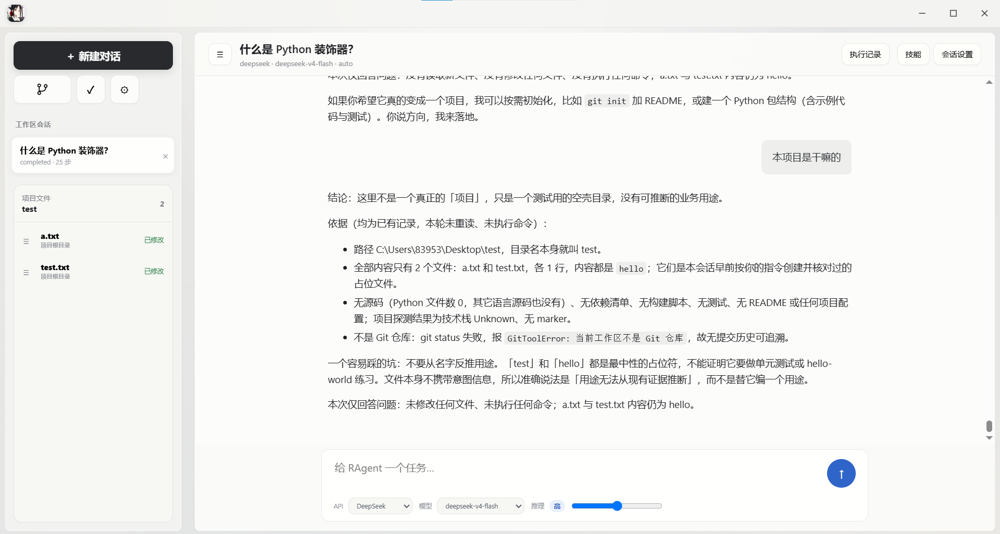
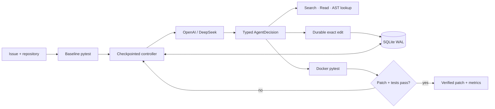

# RAgent

**Current release: v0.2.0 — Initial Stable（初步稳定版）**

## English

**A local desktop coding agent for inspecting, editing, testing, and explaining real software projects.**

RAgent is a local-first coding agent that connects OpenAI or DeepSeek models to a controlled repository workspace. It turns natural-language requests into audited actions such as reading files, searching code, applying exact edits, running approved tests, and reporting evidence. The runtime—not the model—controls file boundaries, permissions, verification, checkpoints, and completion status.



The repository includes automated regression tests, an offline end-to-end repair, a graphical local Studio, and eight reproducible curated bug tasks. See the quality-gate commands below for local validation.

## RAgent Studio

The `ragent-studio` branch provides a desktop-first, interactive coding-agent workspace while retaining the strict verified-repair mode. Its three-pane UI combines persistent conversations, a safe repository file tree and preview, and a live audited action timeline. The audited action set supports listing, lexical search, bounded reads, transactional exact edits, and allowlisted test execution. OpenAI and DeepSeek use one typed `StudioDecision` protocol, and every session, message, observation, token count, and changed file is checkpointed in SQLite.

Each Studio turn creates a persisted five-stage plan and assigns a dynamic step budget from task and repository complexity. Structured memory retains user constraints, confirmed facts, hypotheses, relevant files, and failure evidence across model calls. A Python AST index retrieves relevance-ranked symbols and bounded source snippets, while a request-side Token estimator trims low-priority snippets, old observations, file-tree entries, and old messages before the provider call. Failed tools and tests explicitly return the controller to investigation with a changed-strategy instruction. Automatic mode blocks completion after a code change until deterministic verification passes, and every changed task receives a final Diff review for conflict markers, hard-coded credentials, changed-test risk, and missing verification evidence.

双击桌面 EXE 默认进入 Studio 通用编码 Agent；顶部的“验证修复模式”可返回原来的严格 Bug 修复闭环。Studio 支持连续中文对话、项目文件预览、实时工具轨迹，以及“阅读 → 编辑 → pytest 验证 → 回复”的完整离线测试闭环。

## Engineering properties

- **Verification over self-reporting.** Success requires both a non-empty patch and deterministic passing tests.
- **Crash-consistent edits.** Before writing, RAgent persists exact before/after contents and hashes. Resume handles prepared, fully written and partially written transactions and rejects external drift.
- **Real security boundaries.** The model has no shell. Paths stay inside the repository, tests and metadata cannot be edited, pytest arguments are allowlisted, and external repositories default to Docker.
- **Provider-independent runtime.** OpenAI and DeepSeek share one typed `AgentModel` contract; provider quirks are isolated in adapters.
- **Honest evaluation.** Scripted execution is labeled runtime validation. Only real model runs are labeled model benchmarks; the included eight-task suite is explicitly curated and is not SWE-bench.
- **Observable execution.** SQLite WAL checkpoints, ordered events, token accounting, failure classification, paginated APIs, and a browser trace make every decision inspectable.

## Architecture



The model can select only `search`, `read`, `lookup_symbol`, `edit`, `run_tests`, `finish`, or `fail`. See [architecture](docs/architecture.md), [implementation notes](docs/implementation.md), and [threat model](docs/threat_model.md).

## Quick start: no API key

Windows PowerShell:

```powershell
python -m venv .venv
.\.venv\Scripts\python.exe -m pip install -e ".[dev]"
.\.venv\Scripts\ragent.exe demo
```

The frozen demo copies `examples/discount_bug`, reproduces a failing test, searches and reads the implementation, applies an exact edit, reruns pytest, and stores the patch plus event trace under `runs/`.

Inspect or resume a non-terminal run:

```powershell
.\.venv\Scripts\ragent.exe inspect RUN_ID
.\.venv\Scripts\ragent.exe resume RUN_ID
```

If a process crashed before baseline evidence was committed, resume reruns the baseline. Otherwise it continues from the persisted checkpoint.

## Provider authentication

RAgent accepts provider API keys through environment variables or Windows user-scoped encrypted storage. It prefers Credential Manager and automatically falls back to a DPAPI-encrypted vault when WinVault is unavailable to a long-running service process. It never stores plaintext credentials in SQLite, events, logs, benchmark files, or Git.

```powershell
# Hidden prompt; stored by Windows Credential Manager via keyring
.\.venv\Scripts\ragent.exe auth login deepseek
.\.venv\Scripts\ragent.exe auth status deepseek
.\.venv\Scripts\ragent.exe auth logout deepseek
```

Environment-variable alternative:

```powershell
$env:DEEPSEEK_API_KEY="..."
$env:OPENAI_API_KEY="..."
```

ChatGPT/Codex account login is deliberately not reused as an API credential. OpenAI API billing is separate from ChatGPT subscriptions.

| Provider | Default model | Structured output path |
|---|---|---|
| OpenAI | `gpt-5.6-terra` + medium reasoning | Responses typed output |
| DeepSeek | `deepseek-v4-flash` | Responses JSON Schema |
| DeepSeek Pro | `deepseek-v4-pro` | Chat Completions JSON Output |
| Offline | `scripted-demo` | Deterministic frozen demo only |

Retired `deepseek-chat` and `deepseek-reasoner` names are rejected rather than silently mapped.

### Quota monitoring

DeepSeek exposes a balance endpoint, so RAgent reports availability, CNY/USD totals, granted and topped-up credit, and a configurable low-balance warning without storing the response or credential:

```powershell
.\.venv\Scripts\ragent.exe quota status deepseek
$env:VERIPATCH_DEEPSEEK_LOW_BALANCE="5"
```

`GET /providers/deepseek/quota` returns the same secret-free snapshot for local integrations. OpenAI standard API keys do not expose remaining credit; RAgent reports that boundary explicitly rather than presenting organization usage/costs as available balance.

## Run on a repository

Build the pytest sandbox:

```powershell
docker build -t veripatch-sandbox:latest -f sandbox/Dockerfile .
```

Then run:

```powershell
.\.venv\Scripts\ragent.exe run `
  --repo C:\path\to\python-repository `
  --title "Localized cache collision" `
  --description "Locale must be part of the profile cache key." `
  --provider deepseek `
  --runner docker `
  --pytest-arg tests/test_cache.py
```

External repositories default to the Docker runner. Its bind mount is read-only; networking is disabled; CPU, memory and PID counts are limited; capabilities are dropped; and secrets are removed from the test environment. `--runner local` is only for trusted development fixtures.

## Graphical local Studio

```powershell
.\.venv\Scripts\ragent.exe serve --host 127.0.0.1 --port 8000
```

Open [http://127.0.0.1:8000](http://127.0.0.1:8000); `/` redirects to the unified Studio. The glass desktop workspace combines persistent conversations, repository files, expandable before/after/Diff review, and a Codex-style audited action trace. New and existing sessions can select OpenAI or DeepSeek, a model, reasoning effort, and quick, automatic, or strict verification. Strict verification fixes the command, requires a failing baseline, invalidates evidence after edits, and permits completion only after the same command passes.

Studio includes encrypted API-key configuration, a safe web directory browser, editable idle-session settings, and checkpointed conversations. The removed legacy dashboard is no longer shipped; historical repair runs remain available through the CLI and public `/runs` inspection API.

| Method | Endpoint | Purpose |
|---|---|---|
| `GET` | `/` | Redirect to the unified Studio |
| `GET` | `/studio` | Local coding-agent workspace |
| `GET / POST` | `/studio-api/sessions` | List or create Studio conversations |
| `PATCH` | `/studio-api/sessions/{id}/settings` | Update an idle conversation configuration |
| `GET` | `/providers` | Credential readiness without credential values |
| `GET` | `/system/directories` | Browse local folders for repository selection |
| `POST` | `/providers/{provider}/credentials` | Store and read-back a key in Windows user-encrypted storage without echoing it |
| `DELETE` | `/providers/{provider}/credentials` | Remove a GUI-managed key; environment keys are immutable here |
| `GET` | `/providers/{provider}/quota` | Live, secret-free quota snapshot |
| `POST` | `/demo` | Create an isolated, zero-cost GUI demo |
| `GET / POST` | `/runs` | Paginated run list / create a run |
| `GET` | `/runs/{id}` | Public run status |
| `GET` | `/runs/{id}/events` | Paginated, filtered events |
| `GET` | `/runs/{id}/result` | Terminal state and patch |
| `POST` | `/runs/{id}/resume` | Resume a non-terminal checkpoint |

The API is intentionally local-first and defaults to `127.0.0.1`. It has no authentication and must not be exposed as a public arbitrary-repository execution service.

## Curated benchmark

`benchmarks/interview_tasks.jsonl` defines eight fixed tasks:

| Task | Category | Core failure |
|---|---|---|
| discount-percentage | arithmetic | percentage scaling |
| pagination-offset | boundary | one-based page offset |
| localized-cache-key | cache | missing locale dimension |
| boolean-parser | parsing | false string truthiness |
| inventory-boundary | state | equality boundary |
| exception-scope | exceptions | overly broad exception |
| retry-backoff | sequence | shifted exponent |
| multi-file-surcharge | multi-file | same defect in two modules |

All eight baselines are verified to fail for their intended assertion. This is a small curated benchmark for reproducible evaluation, **not SWE-bench**.

Real DeepSeek benchmark command:

```powershell
.\.venv\Scripts\ragent.exe eval `
  --tasks benchmarks/interview_tasks.jsonl `
  --output results/deepseek-v4-flash.jsonl `
  --report results/deepseek-v4-flash.md `
  --provider deepseek `
  --runner docker
```

Each record includes provider, actual model, reasoning effort, runner, task tree hash, source Git SHA, Docker image identity, budgets, resolved state, steps, duration, model calls, input/cached/output/reasoning Tokens, changed files, and failure category. A score is reported only from a completed real-provider run.

### Verified DeepSeek V4 Flash run

On 2026-08-28, commit `f076b2f` resolved **8/8 tasks (100%)** in the read-only, network-disabled Docker runner. The run averaged 4.38 Agent steps and 11.57 seconds per task and used 78,969 input, 27,008 cached-input, 6,454 output, and 3,831 reasoning Tokens. This is one measured run of the small curated suite—not a claim about SWE-bench or general coding ability. See the [full reproducibility report](docs/benchmark_deepseek_v4_flash.md).

## Quality gates

```powershell
.\.venv\Scripts\python.exe -m ruff check .
.\.venv\Scripts\python.exe -m ruff format . --check
.\.venv\Scripts\python.exe -m mypy src
.\.venv\Scripts\python.exe -m pytest --cov=veripatch --cov-report=term-missing --cov-fail-under=90
.\.venv\Scripts\python.exe -m build --no-isolation
```

GitHub Actions runs the tests on Python 3.11 and 3.13 and separately builds the Docker image.

## Failure semantics

- Baseline passes → fail: the issue was not reproduced.
- Model/API failure → fail with provider classification.
- Tool failure → persist an observation and let the controller recover or stop.
- Three identical actions → fail as a loop/budget condition.
- Step/model-call/input/output budget exhausted → explicit terminal failure.
- Docker unavailable → fail; never silently fall back to host execution.
- Pending transaction does not match before/after hashes → fail on workspace drift.
- Tests do not pass or patch is empty → success is impossible.

## Project layout

```text
src/veripatch/       runtime, providers, tools, API and evaluation
tests/               unit, security, crash recovery and end-to-end tests
examples/            frozen offline repair demo
benchmarks/cases/    eight immutable curated bug repositories
sandbox/             minimal pytest execution image
docs/                architecture, threat model, requirements and append-only log
```
